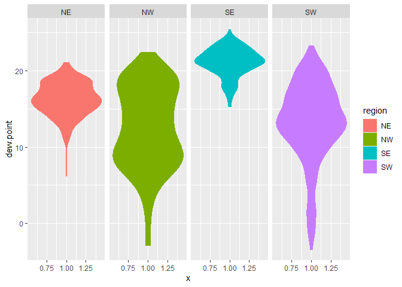
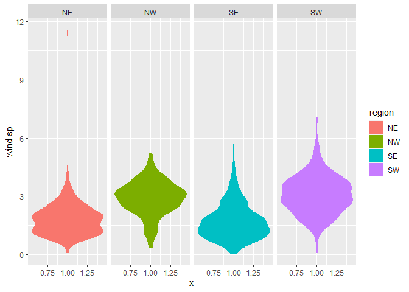
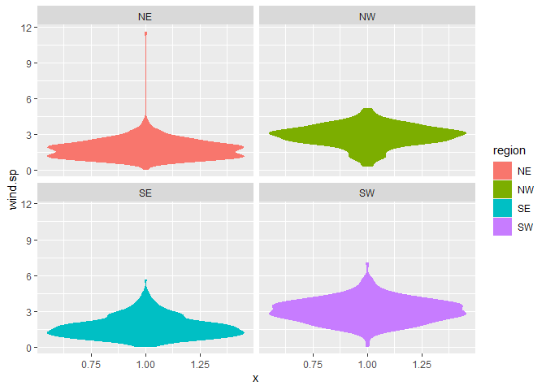
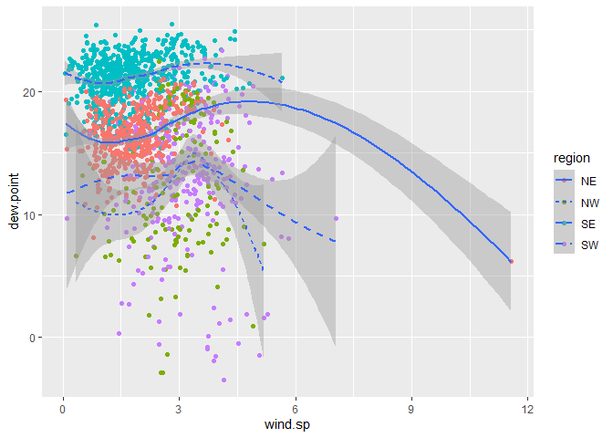
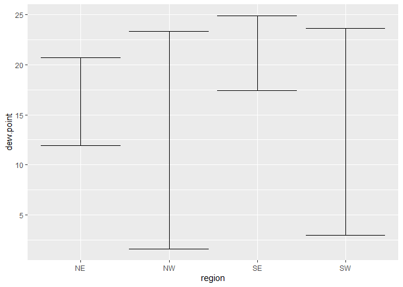
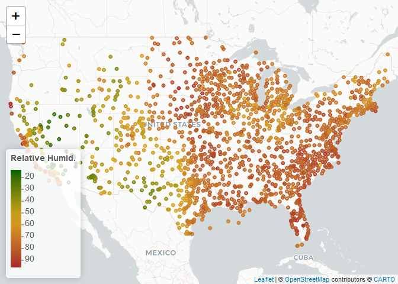

Lab4
================
Yuwei Wu
2022-09-15

## 1. Read in the data

``` r
if (!file.exists("met_all.gz"))
  download.file(
    url = "https://raw.githubusercontent.com/USCbiostats/data-science-data/master/02_met/met_all.gz",
    destfile = "met_all.gz",
    method   = "libcurl",
    timeout  = 60
    )
met <- data.table::fread("met_all.gz")

library(tidyverse)
library(data.table)
library(lubridate)
```

## 2. Prepare the data

Remove temperatures less than -17C

``` r
met <- met[temp>-17][elev==9999.0,elve := NA]
```

Generate a date variable using the functions as.Date() (hint: You will
need the following to create a date paste(year, month, day, sep = “-”)).

``` r
met<- met[ , ymd:= as.Date(paste(year, month, day, sep = "-"))]
```

Using the data.table::week function, keep the observations of the first
week of the month.

``` r
met[ , table(week(ymd))]
```

    ## 
    ##     31     32     33     34     35 
    ## 371544 520440 529571 526312 369337

``` r
met<- met[week(ymd)==31]
```

Compute the mean by station of the variables temp, rh, wind.sp,
vis.dist, dew.point, lat, lon, and elev.

``` r
met[, .(
    temp = max(temp,na.rm = T),
    rh = max(rh,na.rm = T),
    wind.sp = max(wind.sp,na.rm = T),
    vis.dist = max(vis.dist,na.rm = T),
    dew.point = max(dew.point,na.rm = T),
    lat = max(lat,na.rm = T),
    lon = max(lon,na.rm = T),
    elev = max(elev,na.rm = T)
), by = "USAFID"]
```

    ## Warning in gmax(wind.sp, na.rm = TRUE): 至少有一个子集的值全为缺失值。为保持和
    ## base包一致，对这种情况将会返回'-Inf'

    ## Warning in gmax(vis.dist, na.rm = TRUE): 在至少一个分组中没有发现缺失值。为了与
    ## base 保持一致，将这些组强制转换为数值类型并返回 ‘Inf’。

    ##       USAFID temp        rh wind.sp vis.dist dew.point    lat      lon elev
    ##    1: 690150 43.3  35.97508     9.3    16093      10.6 34.300 -116.162  696
    ##    2: 720110 40.0  94.16652     6.2    16093      23.0 30.784  -98.662  336
    ##    3: 720113 32.1  86.25461     6.2    16093      20.6 42.543  -83.178  222
    ##    4: 720120 31.0 100.00000     8.2    30578      25.0 32.224  -80.697    6
    ##    5: 720137 31.3  98.76564     5.1    16093      21.1 41.425  -88.419  178
    ##   ---                                                                      
    ## 1571: 726777 33.9  96.25454    14.4    16093      18.9 46.358 -104.250  906
    ## 1572: 726797 33.3  93.19943    18.0    16093      14.4 45.788 -111.153 1363
    ## 1573: 726798 33.9  83.17287    17.0    16093      13.9 45.698 -110.440 1408
    ## 1574: 726810 37.2  60.34429     7.2    16093      13.3 43.567 -116.233  874
    ## 1575: 726813 36.7  75.06851     7.7    16093      16.1 43.650 -116.633  741

``` r
met_avg <-met[, .(
    temp = mean(temp,na.rm = T),
    rh = mean(rh,na.rm = T),
    wind.sp = mean(wind.sp,na.rm = T),
    vis.dist = mean(vis.dist,na.rm = T),
    dew.point = mean(dew.point,na.rm = T),
    lat = mean(lat,na.rm = T),
    lon = mean(lon,na.rm = T),
    elev = mean(elev,na.rm = T)
), by = "USAFID"]
```

Create a region variable for NW, SW, NE, SE based on lon = -98.00 and
lat = 39.71 degrees

``` r
met_avg<-met_avg[, region := fifelse(lon > - 98 & lat > 39.71, "NE",
                fifelse(lon < - 98 & lat > 39.71, "NW",
                fifelse(lon < - 98 & lat <= 39.71, "SW","SE")))
     ]
table(met_avg$region)
```

    ## 
    ##  NE  NW  SE  SW 
    ## 484 146 649 296

Create a categorical variable for elevation as in the lecture slides

``` r
met_avg[, elev.cat := fifelse(elev>252, "high", "low")]
```

## 3. Use geom_violin to examine the wind speed and dew point temperature by region

Use facets Make sure to deal with NA category Describe what you observe
in the graph

``` r
met_avg[!is.na(region)] %>% 
  ggplot() + 
  geom_violin(mapping = aes(x = 1, y = dew.point, color=region, fill=region)) + 
  facet_wrap(~ region, nrow = 1)
```

<!-- -->

``` r
met_avg[!is.na(region)& !is.na(wind.sp)] %>% 
  ggplot() + 
  geom_violin(mapping = aes(x = 1, y = wind.sp, color=region, fill=region)) + 
  facet_wrap(~ region, nrow = 1)
```

<!-- -->

``` r
met_avg[!is.na(region)& !is.na(wind.sp)] %>% 
  ggplot() + 
  geom_violin(mapping = aes(x = 1, y = wind.sp, color=region, fill=region)) + 
  facet_wrap(~ region, nrow = 2)
```

<!-- -->

The highest dew point temperatures are reported in the southeast.

## 4. Use geom_jitter with stat_smooth to examine the association between dew point temperature and wind speed by region

Colour points by region Make sure to deal with NA category Fit a linear
regression line by region Describe what you observe in the graph

``` r
met_avg[!is.na(region)& !is.na(wind.sp)] %>% 
  ggplot(mapping = aes(x = wind.sp,y = dew.point)) + 
  geom_point(mapping = aes(color = region)) + 
  geom_smooth(mapping = aes(linetype = region))
```

    ## `geom_smooth()` using method = 'loess' and formula 'y ~ x'

<!-- -->

``` r
met_avg[!is.na(region)& !is.na(wind.sp)] %>% 
  ggplot(mapping = aes(x = wind.sp,y = dew.point)) + 
  geom_point(mapping = aes(color = region)) + 
  geom_smooth(method = lm, mapping = aes(linetype = region))+
  facet_wrap(~ region, nrow = 2)
```

    ## `geom_smooth()` using formula 'y ~ x'

<!-- --> \## 5. Use
geom_bar to create barplots of the weather stations by elevation
category coloured by region

## 6. Use stat_summary to examine mean dew point and wind speed by region with standard deviation error bars

``` r
met_avg[!is.na(dew.point)] %>%
  ggplot(mapping = aes(x=region, y=dew.point)) + 
    stat_summary(fun.data = mean_sdl, geom = "errorbar")
```

<!-- --> I can show
with means or with error bars, but I’d like to show both.

## 7. Make a map showing the spatial trend in relative h in the US

``` r
library(leaflet)
# Generating a color palette
rh.pal <- colorNumeric(c('darkgreen','goldenrod','brown'), domain=met_avg$rh)
rh.pal
```

    ## function (x) 
    ## {
    ##     if (length(x) == 0 || all(is.na(x))) {
    ##         return(pf(x))
    ##     }
    ##     if (is.null(rng)) 
    ##         rng <- range(x, na.rm = TRUE)
    ##     rescaled <- scales::rescale(x, from = rng)
    ##     if (any(rescaled < 0 | rescaled > 1, na.rm = TRUE)) 
    ##         warning("Some values were outside the color scale and will be treated as NA")
    ##     if (reverse) {
    ##         rescaled <- 1 - rescaled
    ##     }
    ##     pf(rescaled)
    ## }
    ## <bytecode: 0x000001e331089e48>
    ## <environment: 0x000001e3310887c0>
    ## attr(,"colorType")
    ## [1] "numeric"
    ## attr(,"colorArgs")
    ## attr(,"colorArgs")$na.color
    ## [1] "#808080"

Use addMarkers to include the top 10 places in relative h (hint: this
will be useful rank(-rh) \<= 10)

``` r
top10rh <- met_avg[ rank(-rh) <= 10]
```

``` r
rhmap <- leaflet(met_avg) %>% 
  # The looks of the Map
  addProviderTiles('CartoDB.Positron') %>% 
  # Some circles
  addCircles(
    lat = ~lat, lng=~lon,
                                                  # HERE IS OUR PAL!
    label = ~paste0(rh), color = ~ rh.pal(rh),
    opacity = 1, fillOpacity = 1, radius = 500
    ) %>%
  # And a pretty legend
  addLegend('bottomleft', pal=rh.pal, values=met_avg$rh,
          title='Relative Humid.', opacity=1)
rhmap
```

<!-- -->
